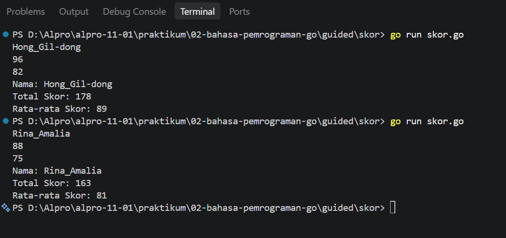
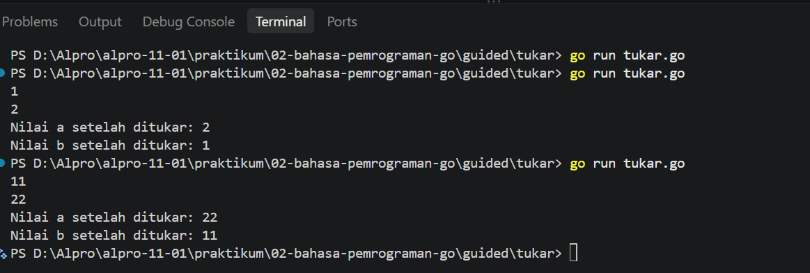
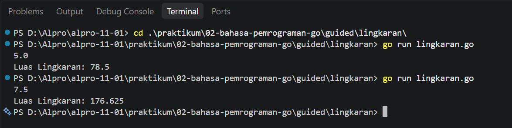
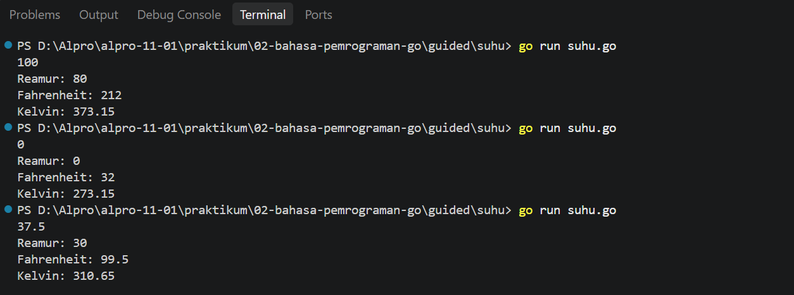
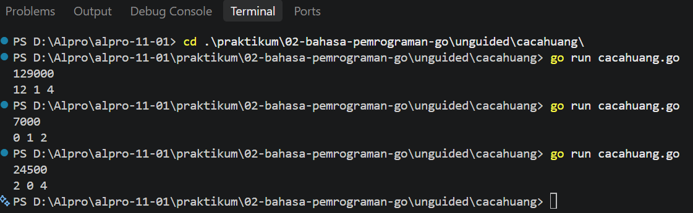
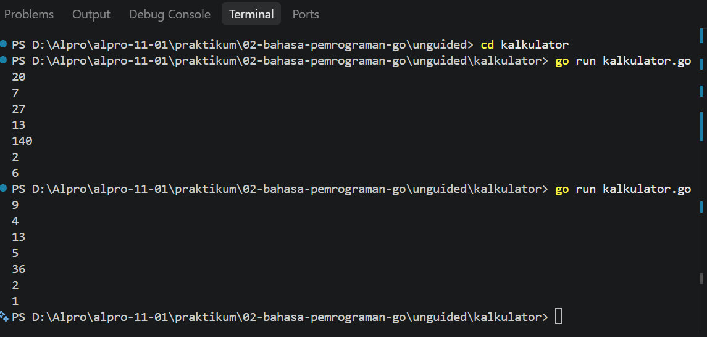

# <h1 align="center">Laporan Praktikum Modul 02 - Bahasa Pemrograman Go (Golang)
</h1>
<p align="center">Fadila Riska Amalia Juniar - 109092600007</p>

## Dasar Teori

### A. Struktur Bahasa Pemrograman Go
Dalam bahasa pemrograman Go, program utama memiliki dua bagian penting, yaitu **package main dan func main()**. **Package main** menunjukkan bahwa file tersebut berisi program utama, sedangkan di **func main()** digunakan untuk menuliskan bagian utama dari program. Pada bahasa pemrograman Go juga menyediakan komentar untuk memberikan keterangan pada kode. **Komentar** dapat dibuat jadi satu baris menggunakan tanda **//**, sedangkan komentar beberapa baris menggunakan tanda /* dan */.

### B. Package dan Struktur Program di Go

#### 1. Pengertian Package main dan func main()
Pada program Go **Package main** digunakan sebagai penanda bahwa file tersebut merupakan bagian dari program utama. Sementara itu, **func main()** menjadi tempat untuk menuliskan perintah yang akan dijalankan ketika program dimulai. Pada contoh di Modul 2, package fmt digunakan untuk membantu proses input dan output.

#### 2. Koding, Kompilasi, dan Eksekusi Go
Program Go ditulis menggunakan penyunting teks dan disimpan dengan ekstensi **.go**. Satu program lengkap dapat terdiri dari beberapa file **.go** selama file-file tersebut berada dalam folder yang sama. Setelah program selesai dibuat, program dapat di kompilasi menggunakan perintah **go build** atau **go build file.go**. Jika proses kompilasi berhasil, akan terbentuk program yang dapat dijalankan. Go juga memiliki beberapa perintah lain seperti **go fmt** untuk merapikan format kode dan **go clean** untuk membersihkan file hasil kompilasi.

#### 3. Variable data dan Tipe Data
Variabel digunakan untuk menyimpan data yang dibutuhkan dalam program. Setiap variabel memiliki tipe data sesuai dengan jenis nilai yang disimpan. Pada Modul 02, terdapat beberapa tipe data yang digunakan, yaitu string, int, dan float64.
Tipe data **string** digunakan untuk menyimpan teks, contohnya nama siswa. Tipe data **int** digunakan untuk menyimpan bilangan bulat, seperti nilai matematika dan bahasa Inggris. Sedangkan **float64** digunakan untuk menyimpan bilangan yang memiliki nilai desimal, seperti jari-jari dan luas lingkaran.
Dalam program, data yang disimpan dalam variabel dapat digunakan untuk melakukan perhitungan atau proses lainnya. Contohnya, pada program skor.go, nilai yang dimasukkan disimpan dalam variabel kemudian digunakan untuk menghitung total dan rata-rata.

## Guided

### 1. [skor.go]

```go
package main

import "fmt"

func main() {
	var nama string
	var skorMatematika, skorBahasaInggris int

	//Membaca input
	fmt.Scan(&nama)
	fmt.Scan(&skorMatematika)
	fmt.Scan(&skorBahasaInggris)

	//Menghitung total & rata-rata (Pembagian bilangan bulat)
	total := skorMatematika + skorBahasaInggris
	rataRata := total / 2

	//Menampilkan output
	fmt.Println("Nama:", nama)
	fmt.Println("Total Skor:", total)
	fmt.Println("Rata-rata Skor:", rataRata)
}
```
#### Deskripsi
Pada program `skor`, saya memasukkan nama, nilai matematika, dan nilai bahasa Inggris. Setelah itu, kedua nilai dijumlahkan untuk mendapatkan total skor, kemudian dihitung rata-ratanya. Hasil yang ditampilkan berupa nama, total skor, dan rata-rata skor.

Program ini merupakan bagian dari **guided/terbimbing**. Dari program ini, saya mempraktikkan cara menerima input, melakukan perhitungan sederhana, dan menampilkan hasil menggunakan `fmt.Println`.

##### Output
<!-- Path relatif dari readme.md ke folder unguided/[nama_soal]/output.png, contoh: -->


### 2. [tukar.go]

```go
package main

import "fmt"

func main() {
	var a, b int

	//Membaca input
	fmt.Scan(&a)
	fmt.Scan(&b)

	//Menukar nilai a dan b
	a, b = b, a

	//Menampilkan output
	fmt.Println("Nilai a setelah ditukar:", a)
	fmt.Println("Nilai b setelah ditukar:", b)
}
```

##### Output
<!-- Path relatif dari readme.md ke folder unguided/[nama_soal]/output.png, contoh: -->


#### Deskripsi
Pada program `tukar`, saya memasukkan dua nilai yaitu `a` dan `b`. Kedua nilai tersebut kemudian ditukar menggunakan perintah `a, b = b, a`. Setelah itu, program menampilkan nilai `a` dan `b` setelah ditukar.

Program ini merupakan bagian dari **guided/terbimbing**. Hasil yang diperoleh adalah nilai `a` dan `b` berhasil bertukar sesuai dengan nilai yang dimasukkan.

<!-- Tambahkan blok file/kode lain sesuai jumlah file pada soal guided -->

### 3. [lingkaran.go]

```go
package main

import "fmt"

func main() {
	var jariJari float64

	//Membaca input
	fmt.Scan(&jariJari)

	//Menghitung luas lingkaran
	luas := 3.14 * jariJari * jariJari

	//Menampilkan output
	fmt.Println("Luas Lingkaran:", luas)
}
```

##### Output
<!-- Path relatif dari readme.md ke folder unguided/[nama_soal]/output.png, contoh: -->


#### Deskripsi
Pada program **lingkaran**, saya memasukkan nilai jari-jari lingkaran. Nilai tersebut kemudian digunakan untuk menghitung luas lingkaran dengan rumus `3.14 * jariJari * jariJari`. Setelah dihitung, hasil luas lingkaran ditampilkan.

Program ini merupakan bagian dari **guided/terbimbing**. Hasil yang diperoleh adalah luas lingkaran sesuai dengan nilai jari-jari yang dimasukkan.

<!-- Tambahkan blok file/kode lain sesuai jumlah file pada soal guided -->

### 4. [suhu.go]

```go
package main

import "fmt"

func main() {
	var celsius float64

	// Membaca masukan
	fmt.Scan(&celsius)

	// Menghitung konversi suhu
	reamur := celsius * 4.0 / 5.0
	fahrenheit := celsius * 9.0 / 5.0 + 32.0
	kelvin := celsius + 273.15

	// Menampilkan output dengan label teks penjelasan
	fmt.Println("Reamur:", reamur)
	fmt.Println("Fahrenheit:", fahrenheit)
	fmt.Println("Kelvin:", kelvin)
}
```

##### Output
<!-- Path relatif dari readme.md ke folder unguided/[nama_soal]/output.png, contoh: -->


#### Deskripsi
Pada program **suhu**, saya memasukkan nilai suhu dalam Celsius. Nilai tersebut kemudian dikonversi ke Reamur, Fahrenheit, dan Kelvin menggunakan rumus yang sudah ditentukan. Setelah itu, hasil dari ketiga konversi tersebut ditampilkan.

Program ini merupakan bagian dari **guided/terbimbing**. Hasil yang diperoleh adalah nilai suhu dalam Reamur, Fahrenheit, dan Kelvin berdasarkan suhu Celsius yang dimasukkan.

<!-- Tambahkan blok file/kode lain sesuai jumlah file pada soal guided -->

## Unguided

### 1. [cacahuang.go]

```go
package main

import "fmt"

func main() {
	//Variabel untuk menyimpan nominal uang
	var uang int

	// Membaca masukan nominal uang
	fmt.Scan(&uang)

	// Menghitung jumlah pecahan uang 10 ribu
	sepuluhRibu := uang / 10000
	sisa := uang % 10000

	// Menghitung jumlah pecahan uang 5 ribu
	limaRibu := sisa / 5000
	sisa = sisa % 5000

	// Menghitung jumlah pecahan uang 1 ribu
	seribu := sisa / 1000

	// Menampilkan hasil perhitungan
	fmt.Println(sepuluhRibu, limaRibu, seribu)
}
```

##### Output
<!-- Path relatif dari readme.md ke folder unguided/[nama_soal]/output.png, contoh: -->



#### Deskripsi
Pada program **cacahuang.go**, saya memasukkan nominal uang dalam rupiah. Setelah itu, program menghitung jumlah pecahan Rp10.000, Rp5.000, dan Rp1.000 yang dapat digunakan untuk menyatakan nominal tersebut. Program menggunakan operasi pembagian / untuk menentukan jumlah pecahan dan sisa bagi % untuk menghitung sisa uang. Setelah semua perhitungan selesai, program menampilkan jumlah masing-masing pecahan. Program ini merupakan bagian dari unguided/mandiri dan hasil yang diperoleh sesuai dengan nominal uang yang dimasukkan.

### 2. [kalkulator.go]

```go
package main

import "fmt"

func main() {
	// Variabel untuk menyimpan dua bilangan
	var a, b int

	// Membaca masukan dua bilangan
	fmt.Scan(&a, &b)

	// Melakukan operasi aritmatika
	penjumlahan := a + b
	pengurangan := a - b
	perkalian := a * b
	pembagian := a / b
	sisaBagi := a % b

	// Menampilkan hasil operasi aritmatika
	fmt.Println(penjumlahan)
	fmt.Println(pengurangan)
	fmt.Println(perkalian)
	fmt.Println(pembagian)
	fmt.Println(sisaBagi)
}
```

##### Output


#### Deskripsi
Pada program **kalkulator.go**, saya memasukkan dua bilangan bulat. Kedua bilangan tersebut kemudian digunakan untuk melakukan beberapa operasi aritmatika, yaitu penjumlahan, pengurangan, perkalian, pembagian, dan sisa bagi. Setelah semua operasi selesai, program menampilkan hasil dari setiap perhitungan. Program ini merupakan bagian dari unguided/mandiri dan hasil yang diperoleh menunjukkan hasil perhitungan dari dua bilangan yang dimasukkan.

<!-- Duplikasi blok "### [nama_soal]" sesuai jumlah folder soal di dalam unguided -->

## Kesimpulan
Setelah melakukan praktikum Modul 02, saya dapat memahami dasar pemrograman Go, mulai dari penggunaan package main dan func main(), variabel, tipe data, input dengan fmt.Scan, serta output dengan fmt.Println. Saya juga memahami penggunaan operator aritmatika seperti penjumlahan, pengurangan, perkalian, pembagian, dan sisa bagi. Selain itu, saya mengetahui bahwa program Go disimpan dengan ekstensi .go dan dapat dikompilasi menggunakan go build. Materi tersebut kemudian diterapkan pada program guided dan unguided untuk menerima input, melakukan proses perhitungan, dan menampilkan hasil.

## Referensi

1. The Go Authors. (n.d.). The Go Programming Language Specification: Comments. Diakses pada 27 September 2026 melalui [https://go.dev/ref/spec#Comments].
2. The Go Authors. (n.d.). The Go Programming Language Specification: Operators and punctuation. Diakses pada 27 September 2026 melalui [https://go.dev/ref/spec#Operators_and_punctuation]
3. The Go Authors. (n.d.). The Go Programming Language Specification: Numeric types. Diakses pada 27 September 2026 melalui [https://go.dev/ref/spec#Numeric_types]
4. The Go Authors. (n.d.). How to Write Go Code. The Go Programming Language. Diakses pada 27 September 2026 melalui [https://go.dev/doc/code]
5. Universitas Telkom. (n.d.). Soal Tugas Praktikum Modul 02: Variabel, Tipe Data, dan Operasi – Bahasa Pemrograman Go (Golang). Laboratorium Praktikum Informatika, Fakultas Informatika, Program Studi S1 Rekayasa Perangkat Lunak.
<!-- Tambahkan nomor referensi berikutnya sesuai kebutuhan -->
